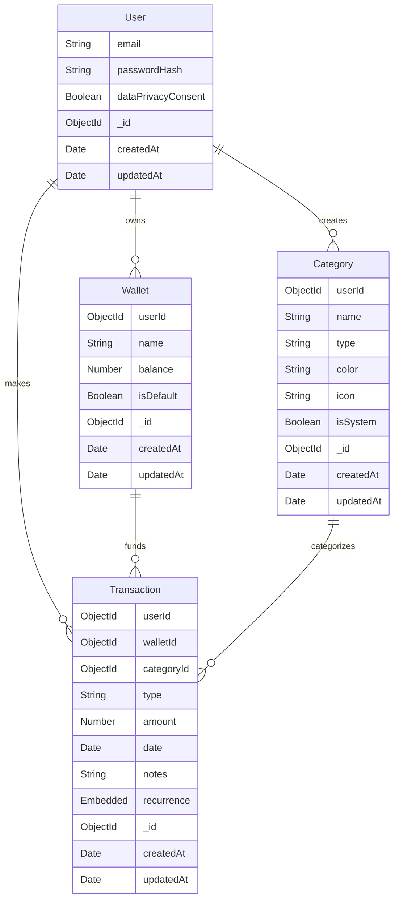

# Fin Lover Database Architecture

```mermaid
erDiagram
  User ||--o{ Wallet : "owns"
  User ||--o{ Category : "creates"
  User ||--o{ Transaction : "makes"
  Wallet ||--o{ Transaction : "funds"
  Category ||--o{ Transaction : "categorizes"

  User {
    String email
    String passwordHash
    Boolean dataPrivacyConsent
    ObjectId _id
    Date createdAt
    Date updatedAt
  }

  Wallet {
    ObjectId userId
    String name
    Number balance
    Boolean isDefault
    ObjectId _id
    Date createdAt
    Date updatedAt
  }

  Category {
    ObjectId userId
    String name
    String type
    String color
    String icon
    Boolean isSystem
    ObjectId _id
    Date createdAt
    Date updatedAt
  }

  Transaction {
    ObjectId userId
    ObjectId walletId
    ObjectId categoryId
    String type
    Number amount
    Date date
    String notes
    Embedded recurrence
    ObjectId _id
    Date createdAt
    Date updatedAt
  }

```
