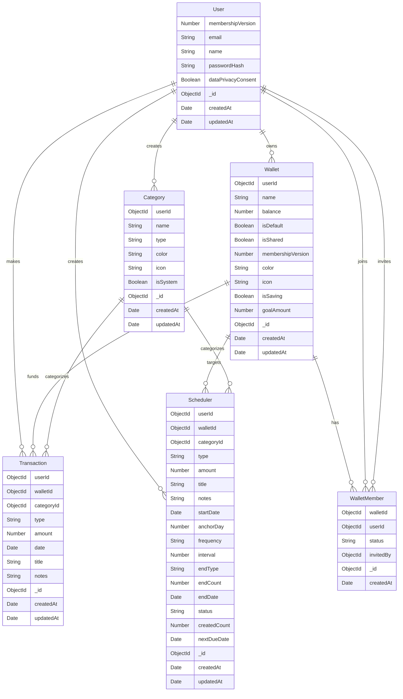

# Fin Lover Database Architecture

```mermaid
erDiagram
  User ||--o{ Wallet : "owns"
  User ||--o{ Category : "creates"
  User ||--o{ Transaction : "makes"
  Wallet ||--o{ Transaction : "funds"
  Category ||--o{ Transaction : "categorizes"
  User ||--o{ Scheduler : "creates"
  Wallet ||--o{ Scheduler : "targets"
  Category ||--o{ Scheduler : "categorizes"

  Wallet ||--o{ WalletMember : "has"
  User ||--o{ WalletMember : "joins"
  User ||--o{ WalletMember : "invites"

  WalletMember {
    ObjectId walletId
    ObjectId userId
    String status
    ObjectId invitedBy
    ObjectId _id
    Date createdAt
  }

  User {
    Number membershipVersion
    String email
    String name
    String passwordHash
    Boolean dataPrivacyConsent
    ObjectId _id
    Date createdAt
    Date updatedAt
  }

  Wallet {
    ObjectId userId
    String name
    Number balance
    Boolean isDefault
    Boolean isShared
    Number membershipVersion
    String color
    String icon
    Boolean isSaving
    Number goalAmount
    ObjectId _id
    Date createdAt
    Date updatedAt
  }

  Category {
    ObjectId userId
    String name
    String type
    String color
    String icon
    Boolean isSystem
    ObjectId _id
    Date createdAt
    Date updatedAt
  }

  Transaction {
    ObjectId userId
    ObjectId walletId
    ObjectId categoryId
    String type
    Number amount
    Date date
    String title
    String notes
    ObjectId _id
    Date createdAt
    Date updatedAt
  }

  Scheduler {
    ObjectId userId
    ObjectId walletId
    ObjectId categoryId
    String type
    Number amount
    String title
    String notes
    Date startDate
    Number anchorDay
    String frequency
    Number interval
    String endType
    Number endCount
    Date endDate
    String status
    Number createdCount
    Date nextDueDate
    ObjectId _id
    Date createdAt
    Date updatedAt
  }

```
